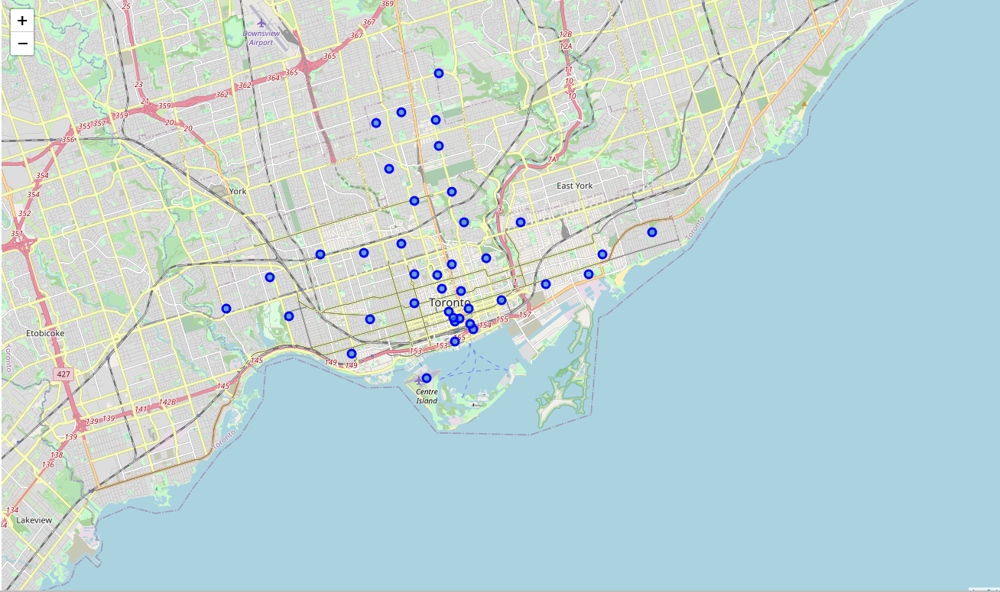
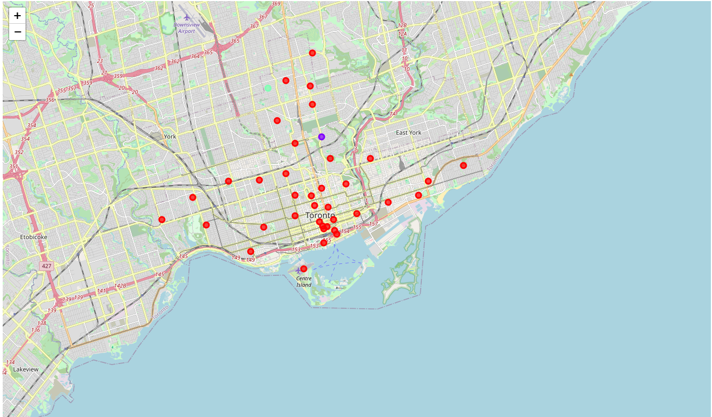

# Where to open a new Thai restaurant in New York?
## Segmenting-and-Clustering-Neighbourhoods-in-Toronto
The repository is a part of the IBM Data Science Capstone project. The project includes the segmentation and clustering of Neighbourhoods in Toronto using K Means Machine Learning Clustering algorithm.

The first map contains the visualization of the various neighbourhoods in Canada whose borough has the word Toronto.

The second map contains the clusters of data using the KMeans ML algorithm.

